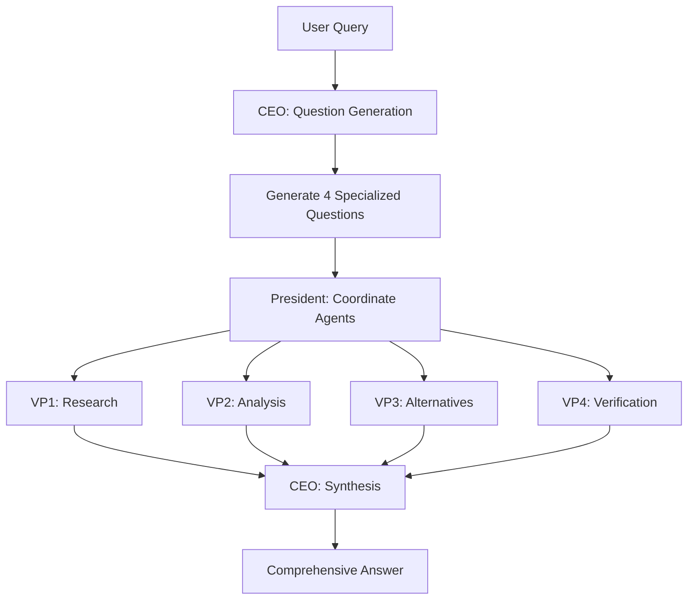

# Claude Code Heavy

A powerful multi-agent research system using Claude Code to deliver comprehensive, multi-perspective analysis through intelligent orchestration. Inspired by Grok's heavy mode and make-it-heavy.

## 🚀 What is Claude Code Heavy?

Claude Code Heavy orchestrates multiple Claude instances in parallel to:
- 🧠 **Deep Analysis**: Generate specialized research questions automatically
- 🔀 **Parallel Research**: Deploy 4+ agents simultaneously for comprehensive coverage  
- 🎯 **Multi-Perspective**: Each agent approaches from a unique angle
- 🔄 **Intelligent Synthesis**: Combine all findings into unified insights
- 📊 **Real-Time Progress**: Visual feedback during execution

## 🎯 Quick Start

```bash
# Clone the repo
git clone https://github.com/yourusername/claude-code-heavy
cd claude-code-heavy

# Make scripts executable
chmod +x heavy.sh

# Run a heavy analysis
./heavy.sh "Who is Pietro Schirano?"
```

## 📖 How It Works



### Architecture

- **Chairman**: You (provides the query)
- **CEO**: Claude Desktop (generates questions, synthesizes results)
- **President**: Claude Code (coordinates VPs)
- **VPs**: Sub-agents (parallel research)

## 🛠️ Installation

### Prerequisites
- Claude Desktop installed
- Claude Code (`npm install -g @anthropic-ai/claude-code`)
- Git with worktree support
- Unix-like environment (Mac/Linux/WSL)

### Setup
```bash
# Install Claude Code if you haven't
npm install -g @anthropic-ai/claude-code

# Clone and setup
git clone https://github.com/yourusername/claude-code-heavy
cd claude-code-heavy
./setup.sh
```

## 🎮 Usage Modes

### Heavy Mode (Default)
Full parallel multi-agent analysis:
```bash
./heavy.sh "Analyze the impact of AI on software development"
```

### Custom Agent Count
Run with more agents for deeper analysis:
```bash
./heavy.sh "Complex quantum computing question" 6
```

### Single Agent Mode
For simpler queries:
```bash
./heavy.sh "What is Python?" 1
```

## 📋 Example Outputs

<details>
<summary>Example: "Who is Pietro Schirano?"</summary>

**Generated Questions:**
1. VP1: Research Pietro Schirano's professional background and career
2. VP2: Analyze contributions and impact on technology/AI
3. VP3: Alternative perspectives and criticisms
4. VP4: Verify current role and recent activities

**Synthesized Result:**
Comprehensive analysis combining all perspectives...
</details>

## 🔧 Configuration

Edit `config.sh` to customize:
```bash
# Number of parallel agents
DEFAULT_AGENTS=4

# Output directory
OUTPUT_DIR="./outputs"

# Synthesis style
SYNTHESIS_STYLE="comprehensive"  # or "concise", "academic"
```

## 🤝 Comparison with make-it-heavy

| Feature | make-it-heavy | claude-code-heavy |
|---------|---------------|-------------------|
| Parallel Agents | ✅ Python threads | ✅ Git worktrees |
| Question Generation | ✅ AI-powered | ✅ AI-powered |
| Tool Access | ✅ Custom tools | ✅ Native + MCP |
| API Limits | ⚠️ OpenRouter limits | ✅ No limits |
| Context Window | ⚠️ Model dependent | ✅ 200k tokens |
| Real Browser | ❌ | ✅ Puppeteer |
| Git Integration | ❌ | ✅ Full tracking |

## 🚀 Advanced Features

### Custom Research Patterns
Create your own research templates in `patterns/`:
```yaml
# patterns/academic.yaml
name: "Academic Research"
agents: 6
questions:
  - "Literature review and citations"
  - "Methodology analysis"
  - "Counter-arguments"
  - "Future research directions"
  - "Practical applications"
  - "Peer review simulation"
```

### MCP Tool Integration
Automatically uses available MCP tools:
- Web search
- GitHub integration
- Google Drive access
- Custom tools

### Persistent Context
Unlike make-it-heavy, maintains context across sessions:
```bash
./heavy.sh --continue "Follow up on previous analysis"
```

## 🏗️ Architecture Details

### File Structure
```
claude-code-heavy/
├── heavy.sh           # Main orchestrator
├── setup.sh          # Setup script
├── config.sh         # Configuration
├── patterns/         # Research patterns
├── outputs/          # Analysis outputs
├── worktrees/        # Agent workspaces
└── templates/        # Prompt templates
```

### How Agents Communicate
1. CEO creates research plan in `research-plan.md`
2. Each VP reads plan and works independently
3. VPs write findings to `vp-N-findings.md`
4. CEO synthesizes all findings

## 🎯 Best Practices

1. **Query Clarity**: More specific queries yield better results
2. **Agent Count**: 4 agents optimal for most queries, 6-8 for complex topics
3. **Time Management**: Expect 2-5 minutes for full analysis
4. **Context Preservation**: Save important outputs for future reference

## 🐛 Troubleshooting

### "Command not found: claude"
```bash
npm install -g @anthropic-ai/claude-code
```

### "Git worktree error"
```bash
# Update git
brew upgrade git  # Mac
sudo apt-get update && sudo apt-get upgrade git  # Linux
```

### Agents seem stuck
```bash
# Check agent status
./heavy.sh --status

# Force cleanup
./heavy.sh --cleanup
```

## 🤝 Contributing

1. Fork the repository
2. Create your feature branch
3. Test with various query types
4. Submit a pull request

## 📄 License

MIT - Inspired by make-it-heavy's approach but implemented entirely with Claude Code.

## 🙏 Acknowledgments

- Inspired by [make-it-heavy](https://github.com/Doriandarko/make-it-heavy) by Pietro Schirano
- Built on [Claude Code](https://docs.anthropic.com/claude-code) by Anthropic
- Uses concepts from [CCCEO](https://github.com/gtrusler/CCCEO) methodology
