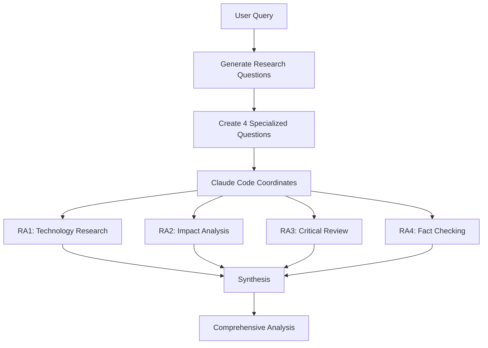

# Claude Code Heavy

A powerful multi-agent research system using Claude Code to deliver comprehensive, multi-perspective analysis through intelligent orchestration. Inspired by Grok's heavy mode and make-it-heavy.

## 🚀 What is Claude Code Heavy?

Claude Code Heavy orchestrates multiple Claude instances in parallel to:
- 🧠 **Deep Analysis**: Generate specialized research questions automatically
- 🔀 **Parallel Research**: Deploy 4+ agents simultaneously for comprehensive coverage  
- 🎯 **Multi-Perspective**: Each agent approaches from a unique angle
- 🔄 **Intelligent Synthesis**: Combine all findings into unified insights
- 📊 **Real-Time Progress**: Visual feedback during execution

## 🎯 Quick Start

```bash
# Clone the repo
git clone https://github.com/yourusername/claude-code-heavy
cd claude-code-heavy

# Make script executable
chmod +x heavy.sh

# Run your research
./heavy.sh "How do we solve the global water supply issue?"
```

This creates:
- 4 Research Assistants (RA1-RA4) with specialized questions
- Git worktrees for parallel execution
- Markdown output by default (use `./heavy.sh "query" 4 text` for text format)
- Organized output in `./outputs/2025-07-18-Your-Query/`

## 📖 How It Works



### Research Process

1. **Query Input**: You provide a research question
2. **Question Generation**: System creates specialized angles
3. **Parallel Research**: Claude Code coordinates Research Assistants
4. **Synthesis**: Findings combined into comprehensive analysis

## 🛠️ Installation

### Prerequisites
- Claude Desktop installed
- Claude Code (`npm install -g @anthropic-ai/claude-code`)
- Git with worktree support
- Unix-like environment (Mac/Linux/WSL)

### Setup
```bash
# Install Claude Code if you haven't
npm install -g @anthropic-ai/claude-code

# Clone and setup
git clone https://github.com/yourusername/claude-code-heavy
cd claude-code-heavy
./setup.sh
```

## 🎮 Usage

### Default Mode (4 Research Assistants)
```bash
./heavy.sh "Analyze the impact of AI on software development"
```

### Custom Assistant Count
```bash
./heavy.sh "Complex quantum computing question" 6
```

### Text Output Format
```bash
./heavy.sh "What is Python?" 2 text
```

### Output Structure
```
outputs/
└── 2025-07-18-Your-Query/
    ├── coordination-prompt.md
    ├── assistants/
    │   ├── ra-1-findings.md
    │   ├── ra-2-findings.md
    │   ├── ra-3-findings.md
    │   └── ra-4-findings.md
    └── final-analysis.md
```

## 📋 Example Output

<details>
<summary>Example: "What would a city designed entirely by AI optimize for?"</summary>

**Research Questions:**
- RA1: Current real-world examples of AI in urban planning
- RA2: What metrics would AI optimize for vs human priorities
- RA3: Human needs that AI might miss or ignore
- RA4: Verify claims about smart cities and human satisfaction

**Synthesized Result:**
AI would create a 98% efficient city with zero traffic jams but potentially zero human joy. While Singapore shows 15% traffic reduction with AI, residents of "perfect" cities like Brasília flee to chaotic neighborhoods for actual life...
</details>

## 🔧 Configuration

Edit `config.sh` to customize:
```bash
# Number of parallel agents
DEFAULT_AGENTS=4

# Output directory
OUTPUT_DIR="./outputs"

# Synthesis style
SYNTHESIS_STYLE="comprehensive"  # or "concise", "academic"
```

## 🤝 Comparison with make-it-heavy

| Feature | make-it-heavy | claude-code-heavy |
|---------|---------------|-------------------|
| Parallel Agents | ✅ Python threads | ✅ Git worktrees |
| Question Generation | ✅ AI-powered | ✅ Pre-configured |
| Tool Access | ✅ Custom tools | ✅ Native + MCP |
| API Required | ✅ OpenRouter | ❌ No API needed |
| Setup Time | ~5 minutes | ~30 seconds |
| Context Window | ⚠️ Model dependent | ✅ 200k tokens |
| Real Browser | ❌ | ✅ Full access |

## 🚀 Advanced Features

### Custom Research Patterns
Create your own research templates in `patterns/`:
```yaml
# patterns/academic.yaml
name: "Academic Research"
agents: 6
questions:
  - "Literature review and citations"
  - "Methodology analysis"
  - "Counter-arguments"
  - "Future research directions"
  - "Practical applications"
  - "Peer review simulation"
```

### MCP Tool Integration
Automatically uses available MCP tools:
- Web search
- GitHub integration
- Google Drive access
- Custom tools

### Persistent Context
Unlike make-it-heavy, maintains context across sessions:
```bash
./heavy.sh --continue "Follow up on previous analysis"
```

## 🏗️ Architecture Details

### File Structure
```
claude-code-heavy/
├── heavy.sh           # Main orchestrator
├── setup.sh          # Setup script
├── config.sh         # Configuration
├── patterns/         # Research patterns
├── outputs/          # Analysis outputs
├── worktrees/        # Agent workspaces
└── templates/        # Prompt templates
```

### How Agents Communicate
1. CEO creates research plan in `research-plan.md`
2. Each VP reads plan and works independently
3. VPs write findings to `vp-N-findings.md`
4. CEO synthesizes all findings

## 🎯 Best Practices

1. **Query Clarity**: More specific queries yield better results
2. **Agent Count**: 4 agents optimal for most queries, 6-8 for complex topics
3. **Time Management**: Expect 2-5 minutes for full analysis
4. **Context Preservation**: Save important outputs for future reference

## 🐛 Troubleshooting

### "Command not found: claude"
```bash
npm install -g @anthropic-ai/claude-code
```

### "Git worktree error"
```bash
# Update git
brew upgrade git  # Mac
sudo apt-get update && sudo apt-get upgrade git  # Linux
```

### Agents seem stuck
```bash
# Check agent status
./heavy.sh --status

# Force cleanup
./heavy.sh --cleanup
```

## 🤝 Contributing

1. Fork the repository
2. Create your feature branch
3. Test with various query types
4. Submit a pull request

## 📄 License

MIT - Inspired by make-it-heavy's approach but implemented entirely with Claude Code.

## 🙏 Acknowledgments

- Inspired by [make-it-heavy](https://github.com/Doriandarko/make-it-heavy) by Pietro Schirano
- Built on [Claude Code](https://docs.anthropic.com/claude-code) by Anthropic
- Uses concepts from [CCCEO](https://github.com/gtrusler/CCCEO) methodology
