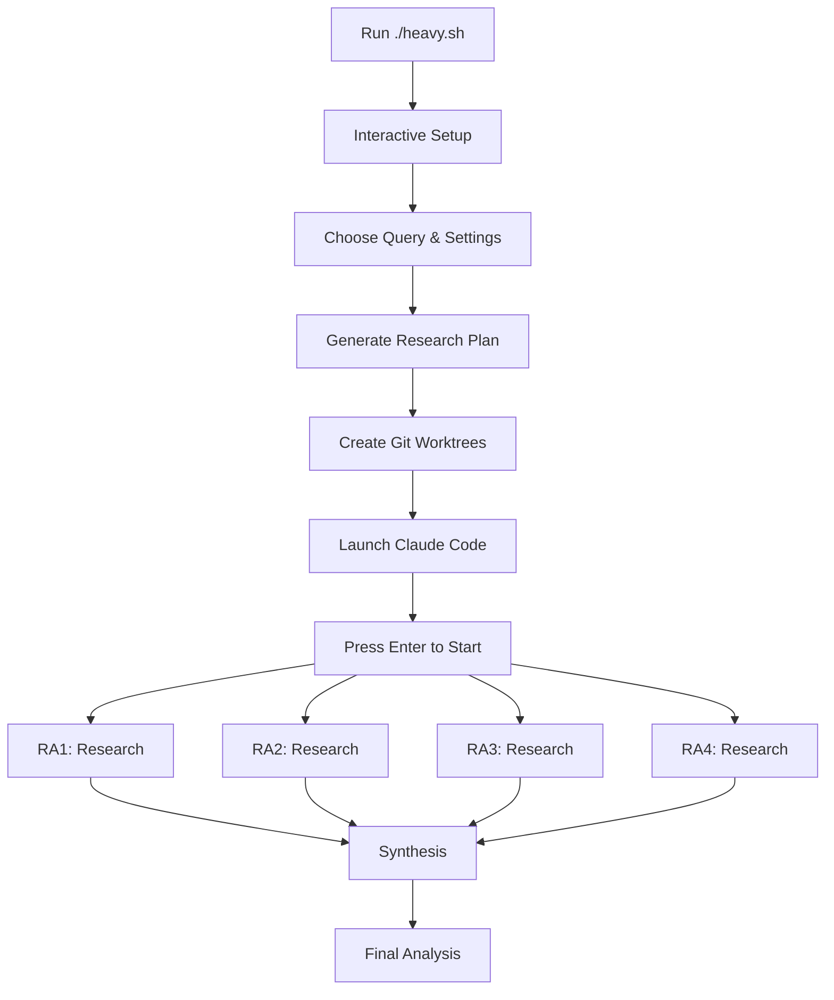

# Claude Code Heavy

A powerful multi-agent research system using Claude Code to deliver comprehensive, multi-perspective analysis through intelligent orchestration. Inspired by Grok's heavy mode and make-it-heavy.

## 🚀 What is Claude Code Heavy?

Claude Code Heavy orchestrates multiple research assistants in parallel to:
- 🧠 **Deep Analysis**: Generate specialized research questions automatically
- 🔀 **Parallel Research**: Deploy 2-6 agents simultaneously for comprehensive coverage  
- 🎯 **Multi-Perspective**: Each agent approaches from a unique angle
- 🔄 **Intelligent Synthesis**: Combine all findings into unified insights
- 🚙 **Interactive Mode**: User-friendly prompts for easy operation

## 🎯 Quick Start

```bash
# Clone the repo
git clone https://github.com/yourusername/claude-code-heavy
cd claude-code-heavy

# Make script executable
chmod +x ccheavy.sh

# Run interactively (recommended)
./ccheavy.sh

# Or run with command line args
./ccheavy.sh "How do we solve the global water supply issue?"
```

## 🤔 Why Interactive Mode?

We use an interactive approach rather than headless execution for several important reasons:

1. **No API Costs**: Running in headless mode requires API keys and incurs per-token costs. Interactive mode lets you use Claude Code's full capabilities without any additional charges.

2. **Full Context Window**: API calls are limited by token constraints, while interactive Claude Code sessions have access to the full 200k token context window.

3. **Real-time Oversight**: You can monitor the research progress, see what each assistant is finding, and intervene if needed.

4. **Browser Access**: Interactive mode gives Claude access to web search and browser tools that aren't available in headless API mode.

5. **One-Click Execution**: While not fully automated, we've made it as simple as possible - the script pre-fills the entire coordination prompt, so you just press Enter to start.

## 📖 How It Works



### Research Process

1. **Interactive Setup**: Run `./ccheavy.sh` for guided setup or provide command line args
2. **Smart Suggestions**: System suggests optimal number of assistants based on query
3. **Automated Launch**: Option to launch Claude Code with pre-filled prompt
4. **Parallel Research**: Claude coordinates multiple research assistants
5. **Comprehensive Output**: All findings saved to organized folders

## 🛠️ Installation

### Prerequisites
- Claude Desktop installed
- Git with worktree support (git 2.7+)
- Unix-like environment (Mac/Linux/WSL)

### Setup
```bash
# Clone and setup
git clone https://github.com/yourusername/claude-code-heavy
cd claude-code-heavy
./setup.sh
```

## 🎮 Usage

### Interactive Mode (Recommended)
```bash
./ccheavy.sh
# Follow the prompts:
# - Enter your research question
# - Accept or modify suggested assistant count
# - Choose output format
# - Confirm to proceed (default: Y)
# - Optionally auto-launch Claude Code (default: Y)
```

### Command Line Mode
```bash
# Default: 4 assistants, markdown output
./ccheavy.sh "Analyze the impact of AI on software development"

# Custom assistant count
./ccheavy.sh "Complex quantum computing question" 6

# Text output format
./ccheavy.sh "What is Python?" 2 text
```

### Smart Folder Naming
Queries are converted to readable folder names:
- "How do we solve the global water crisis?" → `2025-07-18-solve-global-water-crisis`
- "What is the future of AI?" → `2025-07-18-future-ai`
- "Analyze renewable energy trends" → `2025-07-18-analyze-renewable-energy-trends`

### Output Structure
```
outputs/
└── 2025-07-18-solve-global-water-crisis/
    ├── coordination-prompt.md     # The prompt to paste/auto-load
    ├── assistants/
    │   ├── ra-1-findings.md      # RA1's research
    │   ├── ra-2-findings.md      # RA2's research
    │   ├── ra-3-findings.md      # RA3's research
    │   └── ra-4-findings.md      # RA4's research
    └── final-analysis.md         # Synthesized results
```

## 📋 Example Output

<details>
<summary>Example: "What would a city designed entirely by AI optimize for?"</summary>

**Research Questions:**
- RA1: Current real-world examples of AI in urban planning
- RA2: What metrics would AI optimize for vs human priorities
- RA3: Human needs that AI might miss or ignore
- RA4: Verify claims about smart cities and human satisfaction

**Synthesized Result:**
AI would create a 98% efficient city with zero traffic jams but potentially zero human joy. While Singapore shows 15% traffic reduction with AI, residents of "perfect" cities like Brasília flee to chaotic neighborhoods for actual life...
</details>

## 🔧 Configuration

The script intelligently suggests settings based on your query:
- Simple queries: 2 assistants
- Analytical queries: 3 assistants  
- Comprehensive queries: 4 assistants

Edit `config.sh` for defaults:
```bash
# Number of parallel agents
DEFAULT_AGENTS=4

# Output directory
OUTPUT_DIR="./outputs"
```

## 🤝 Comparison with make-it-heavy

| Feature | make-it-heavy | claude-code-heavy |
|---------|---------------|-------------------|
| Parallel Agents | ✅ Python threads | ✅ Git worktrees |
| Question Generation | ✅ AI-powered | ✅ Pre-configured |
| Tool Access | ✅ Custom tools | ✅ Native + web search |
| API Required | ✅ OpenRouter ($$$) | ❌ No API needed |
| Setup Time | ~5 minutes | ~30 seconds |
| Context Window | ⚠️ Model dependent | ✅ 200k tokens |
| Launch Method | Command line | Interactive + Auto-launch |
| Cost | Per-token charges | Free (using Claude Code) |

## 🚀 Advanced Features

### Smart Assistant Count
The system analyzes your query to suggest optimal assistant count:
- Keywords like "comprehensive", "detailed" → 4 assistants
- Complex analytical queries → 3 assistants
- Simple lookups → 2 assistants

### Pre-defined Research Patterns
For 4-assistant queries, uses specialized perspectives:
1. Technology & Implementation
2. Impact & Economics
3. Critical Analysis
4. Verification & History

### One-Click Launch
When you choose to auto-launch Claude Code:
1. Script generates complete coordination prompt
2. Launches Claude with prompt pre-filled
3. You just press Enter to start research
4. No copy-paste needed!

## 🏗️ Architecture Details

### Why Git Worktrees?
- Each assistant gets isolated workspace
- Parallel execution without conflicts
- Easy context switching for Claude
- Git tracks all research history

### Interactive Benefits
- See research progress in real-time
- Claude can use web search effectively
- No token limits or API restrictions
- Full browser automation if needed

## 🎯 Best Practices

1. **Use Interactive Mode**: Just run `./ccheavy.sh` for the best experience
2. **Trust the Suggestions**: Assistant count suggestions are based on query analysis
3. **Let it Auto-Launch**: Choose 'y' when asked to launch Claude automatically
4. **Save Important Results**: Final analysis saved in timestamped folders

## 🐛 Troubleshooting

### "Command not found: claude"
Make sure Claude Desktop is installed and in your PATH

### "Git worktree error"
```bash
# Update git
brew upgrade git  # Mac
sudo apt-get update && sudo apt-get upgrade git  # Linux
```

### Claude Code doesn't launch
Ensure Claude Desktop is running before using auto-launch

## 🤝 Contributing

1. Fork the repository
2. Create your feature branch
3. Test with various query types
4. Submit a pull request

## 📄 License

MIT - Inspired by make-it-heavy's approach but implemented entirely with Claude Code.

## 🙏 Acknowledgments

- Inspired by [make-it-heavy](https://github.com/Doriandarko/make-it-heavy) by Pietro Schirano
- Built on Claude Code by Anthropic
- Smart folder naming and interactive features for better UX
